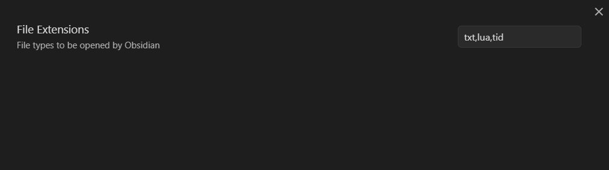

### How it works

This plugin lets you edit non-markdown files in Obsidian as if they are .md files. You can set the extension of the file type you want to be able to edit in Obsidian by setting the extension in the plugin's settings window. Please be sure to separate them by commas as shown in the image below.

You need to disable and enable the plugin after setting the file extensions.

### Compatibility

The required APIs were only added in Obsidian **0.10.12**, and as such, that is the minimum version of Obsidian required to use this plugin. 

## Installation

### From within Obsidian
You can activate this plugin within Obsidian by doing the following:
- Open Settings > Third-party plugin
- Make sure Safe mode is **off**
- Click Browse community plugins
- Search for this plugin
- Click Install
- Once installed, close the community plugins window and activate the newly installed plugin
#### Updates
You can follow the same procedure to update the plugin

### From GitHub
- Download the Latest Release from the Releases section of the GitHub Repository
- Extract the plugin folder from the zip to your vault's plugins folder: `<vault>/.obsidian/plugins/`  
Note: On some machines the `.obsidian` folder may be hidden. On MacOS you should be able to press `Command+Shift+Dot` to show the folder in Finder.
- Reload Obsidian
- If prompted about Safe Mode, you can disable safe mode and enable the plugin.
Otherwise head to Settings, third-party plugins, make sure safe mode is off and
enable the plugin from there.

## Development

This project uses Typescript to provide type checking and documentation.  
The repo depends on the latest [plugin API](https://github.com/obsidianmd/obsidian-api) in Typescript Definition format, which contains TSDoc comments describing what it does.

**Note:** The Obsidian API is still in early alpha and is subject to change at any time!

If you want to contribute to development and/or just customize it with your own
tweaks, you can do the following:
- Clone this repo.
- `npm i` or `yarn` to install dependencies
- `npm run build` to compile.
- Copy `manifest.json`, `main.js` and `styles.css` to a subfolder of your plugins
folder (e.g, `<vault>/.obsidian/plugins/<plugin-name>/`)
- Reload obsidian to see changes

Alternately, you can clone the repo directly into your plugins folder and once
dependencies are installed use `npm run dev` to start compilation in watch mode.  
You may have to reload obsidian (`ctrl+R`) to see changes.

## Pricing
Huh? This is an open-source plugin I made *for fun*. It's completely free.
However, if you absolutely *have* to send me money because you like it that
much, feel free to throw some coins in my hat via the following:

# Version History
## 0.0.3
Initial release!
